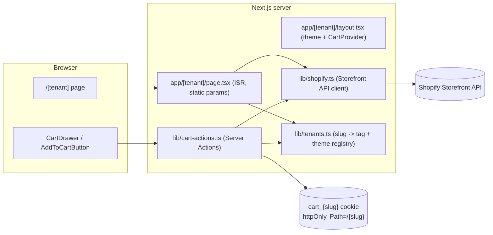

# Multifront

A multi-tenant Shopify storefront engine built with Next.js. A single deployment serves several independently themed storefronts (e.g. `/alpha`, `/beta`, `/omega`) from one shared Shopify store, each showing only the products tagged for that tenant, with fully separated carts and no cross-tenant enumeration or linking. The platform is category-agnostic — a tenant can be a sports club's team shop, a band's merch drop, an event pop-up, or any other storefront that needs its own catalog slice and branding without its own deployment.

## Tech stack

- **Framework:** [Next.js 15](https://nextjs.org) (App Router, Turbopack), React 19, TypeScript
- **Styling:** Tailwind CSS v4
- **Commerce backend:** Shopify Storefront API (GraphQL, private app token), consumed server-side only
- **State/data:** No client-side data store — cart state lives in React context, hydrated via Next.js Server Actions; product data is fetched server-side with ISR
- **Linting:** ESLint (`next/core-web-vitals`, `next/typescript`)

## Architecture

One Next.js app serves N storefronts under a dynamic `[tenant]` route segment — any independently branded storefront, regardless of merchandise category. Each tenant is a static config entry (name, Shopify product tag, color theme) in `lib/tenants.ts` — there is no database and no per-tenant deployment.



**Routing & tenancy**
- `app/[tenant]/page.tsx` pre-renders one static route per entry in `lib/tenants.ts` (`generateStaticParams`, `dynamicParams = false` — any slug not in the registry 404s at the router, before any Shopify call). Pages revalidate every 300s (ISR).
- `app/[tenant]/layout.tsx` resolves the tenant config, injects its theme colors as CSS custom properties, and wraps the page in `CartProvider`.
- The root `/` route (`app/page.tsx`) is intentionally a generic landing page — by design it never lists or links to tenant storefronts. `app/robots.ts` disallows all crawling, and tenant pages additionally set `robots: noindex`. There is no sitemap. The goal is that tenant storefronts are only reachable by someone who already has the URL.

**Product data**
- `lib/shopify.ts` is a `server-only` GraphQL client for the Shopify Storefront API (API version pinned, private-token auth via the `Shopify-Storefront-Private-Token` header — never exposed to the client).
- `getProductsByTag(tag)` queries products by the tenant's Shopify tag. `lib/tenants.ts` is the single source of truth for slug → tag mapping, so a tenant's product query always comes from server-trusted config, never from anything in the URL — this is the core of the store isolation.

**Cart handling**
- Cart mutations (`createCart`, `addToCart`, `updateCartLines`, `removeFromCart`, `getCart`) also live in `lib/shopify.ts`, always fetched with `cache: "no-store"` since cart data is per-visitor.
- `lib/cart-actions.ts` exposes these as Next.js Server Actions (`"use server"`). Every action re-validates the tenant slug against `lib/tenants.ts` and derives an httpOnly cookie named `cart_{slug}`, scoped to `Path=/{slug}`. The cart ID never reaches client JS, and the browser will only present a tenant's cart cookie on that tenant's own routes — so one tenant's cart can't leak into another's session.
- Because tenant pages are statically rendered (ISR), the cart itself can't live in server-rendered HTML. `components/cart-provider.tsx` hydrates it client-side on mount via a Server Action call, then keeps it in React context (`useCart`) for `AddToCartButton` and `CartDrawer` to read/update via `useTransition`.

## Folder structure

```
app/
  page.tsx           Generic root landing page (no tenant links)
  layout.tsx          Root HTML layout, fonts
  robots.ts            Global disallow-all robots rule
  [tenant]/
    layout.tsx         Resolves tenant config, injects theme, wraps CartProvider
    page.tsx            Static per-tenant product listing (ISR)
components/
  product-grid.tsx      Renders products for the active tenant's theme
  add-to-cart-button.tsx
  cart-drawer.tsx        Slide-over cart UI (view/update/remove lines, checkout link)
  cart-provider.tsx      Client-side cart context, calls the Server Actions
lib/
  tenants.ts              Tenant registry: slug -> { name, Shopify tag, theme }
  shopify.ts              server-only Storefront API client (products + cart)
  cart-actions.ts          "use server" cart actions, cookie-based cart isolation
public/                    Static assets (default Next.js icons)
```

## Local development

```bash
npm install
cp .env.example .env.local   # then fill in the values below
npm run dev                  # starts Next.js with Turbopack on http://localhost:3000
```

Visit a configured tenant storefront directly, e.g. `http://localhost:3000/alpha`, `/beta`, or `/omega` (see `lib/tenants.ts` for the current list). The root `/` intentionally does not link to any of them.

Other scripts:

```bash
npm run build   # production build (Turbopack)
npm run start   # run the production build
npm run lint    # ESLint
```

## Environment variables

Defined in `.env.example`; copy to `.env.local` for local dev (never commit real values):

| Variable | Description |
| --- | --- |
| `SHOPIFY_STORE_DOMAIN` | Shopify store domain, e.g. `your-store.myshopify.com` (no protocol) |
| `SHOPIFY_STOREFRONT_TOKEN` | Private Storefront API token, used server-side only (sent as `Shopify-Storefront-Private-Token`) |

Both are required — `lib/shopify.ts` throws immediately if either is missing.

Products are assigned to a tenant by tagging them in Shopify with that tenant's tag (see `tag` field per entry in `lib/tenants.ts`, e.g. `team:alpha`). The `team:` prefix is an existing Shopify-side tagging convention on the connected store and is left as-is; it's independent of the app-side tenant slug.

## Adding a new tenant

Add an entry to the `tenants` object in `lib/tenants.ts` (name, Shopify tag, theme colors) and tag the corresponding products in Shopify — that's the entire integration surface. No other code changes are required; the new route is picked up automatically via `generateStaticParams`. A tenant can represent any merchandise vertical (a sports team, a band, an event, a corporate store) — the platform doesn't assume a product category.

## Deployment

No deployment configuration (e.g. `vercel.json`) is checked into the repo. As a standard Next.js App Router project using `next build`, it deploys as-is to any Next.js-compatible host (Vercel, etc.); the two Shopify env vars must be set in that environment. `next.config.ts` allow-lists `cdn.shopify.com` for `next/image`.
